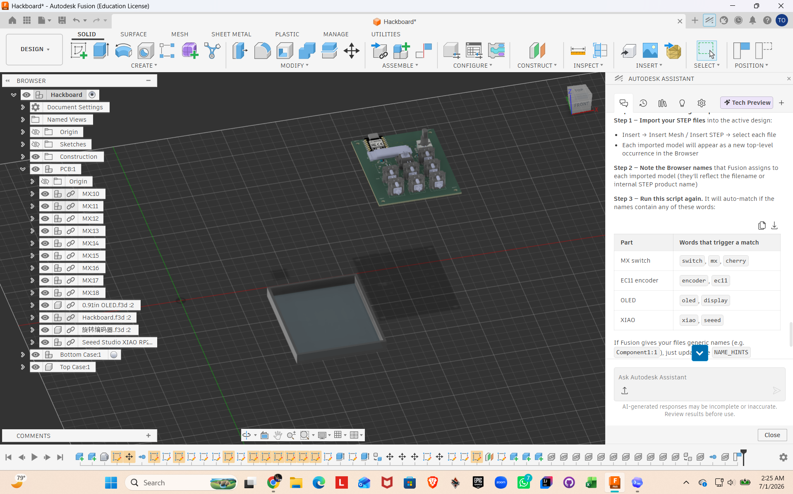
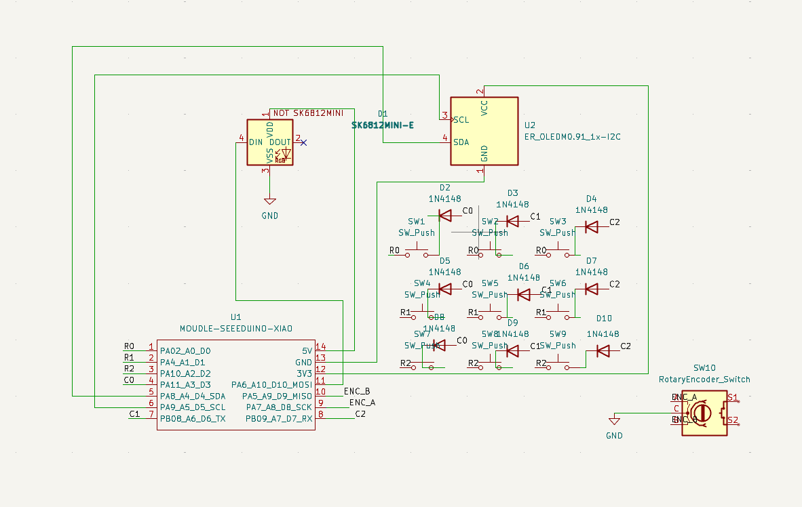
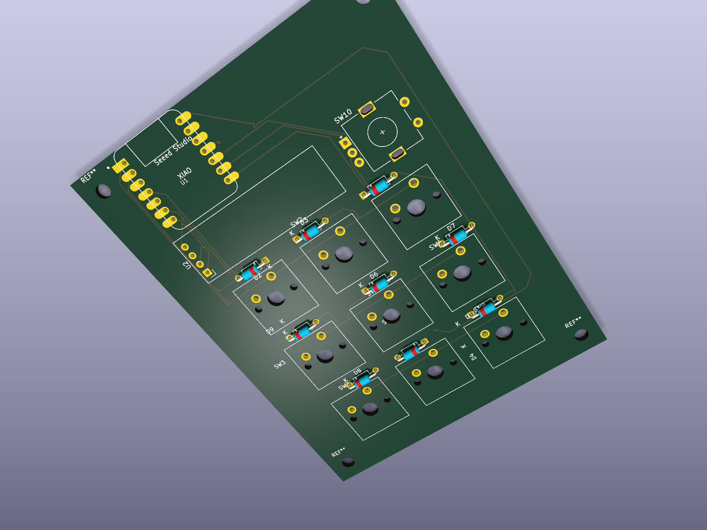

# Jampad

Jampad is a compact 3×3 mechanical macropad built around a through-hole
Seeed Studio XIAO RP2040. It includes an EC11 rotary encoder, a 0.91-inch
128×32 OLED, and a single SK6812 MINI-E status LED in a two-piece 3D-printed
enclosure.

> **Fabrication status:** the nine switch-to-diode connections have been
> repaired. KiCad reports zero unconnected pads and no copper-clearance
> errors. Final Gerbers and drill files are included in
> `production/gerbers.zip`. Review the remaining non-electrical DRC warnings
> in `production/drc_report.txt` before ordering.

## Project images

### Overall assembly and case



### Schematic



### PCB



## Default controls

| Undo | Copy | Paste |
|---|---|---|
| Previous track | Play/Pause | Next track |
| Escape | Windows screenshot | Delete |

The encoder controls system volume:

- Counter-clockwise: volume down
- Clockwise: volume up
- Press: unavailable because the encoder's `S1` and `S2` switch contacts are
  not connected in this PCB revision

## Hardware

- MCU: Seeed Studio XIAO RP2040
- Switches: 9× Cherry MX-compatible switches in a diode-protected 3×3 matrix
- Display: 0.91-inch SSD1306-compatible 128×32 I²C OLED
- Encoder: EC11-style quadrature rotary encoder
- Lighting: 1× SK6812 MINI-E addressable RGB LED
- PCB: two layers, approximately 76.2 × 99.54 mm
- Case: two-piece 3D-printed enclosure

## Firmware pin map

| Function | XIAO pin | RP2040 GPIO |
|---|---:|---:|
| Matrix row 0 | D0 | GP26 |
| Matrix row 1 | D1 | GP27 |
| Matrix row 2 | D2 | GP28 |
| Matrix column 0 | D3 | GP29 |
| OLED SDA | D4 | GP6 |
| OLED SCL | D5 | GP7 |
| Matrix column 1 | D6 | GP0 |
| Matrix column 2 | D7 | GP1 |
| Encoder A | D8 | GP2 |
| Encoder B | D9 | GP4 |
| SK6812 data | D10 | GP3 |

The matrix diode direction is `COL2ROW`.

## Bill of materials

| Quantity | Part | Notes |
|---:|---|---|
| 1 | Seeed Studio XIAO RP2040 | Through-hole mounted |
| 9 | MX-compatible mechanical switches | PCB-mount style |
| 9 | MX-compatible keycaps | 1U |
| 9 | 1N4148 through-hole diodes | Matrix diodes |
| 1 | EC11-style rotary encoder | Rotation is wired; push switch is not |
| 1 | Encoder knob | Sized for the selected shaft |
| 1 | 0.91-inch 128×32 I²C OLED | SSD1306-compatible, four pins |
| 1 | SK6812 MINI-E | Addressable RGB status LED |
| 1 | Custom two-layer PCB | Maximum 100 × 100 mm |
| 1 | 3D-printed top case | Production STEP included |
| 1 | 3D-printed bottom case | Production STEP included |
| 4 | M3×16 mm screws | Confirm final stack height before ordering |
| 4 | M3 heat-set inserts | Approximately 4 mm OD × 5 mm long |

## Repository structure

```text
Jampad_Submission/
├── CAD/          # Full assembly source/export goes here
├── PCB/          # KiCad source files
├── Firmware/     # QMK source
├── production/   # Manufacturing and flash files
└── assets/       # README screenshots
```

## Firmware build

Copy `Firmware/` to `qmk_firmware/keyboards/jampad/`, then run:

```sh
qmk compile -kb jampad -km default
```

The compiled firmware is included as `production/firmware.uf2`.

To flash it, hold the XIAO's **BOOT** button while connecting USB, then copy
`firmware.uf2` to the `RPI-RP2` drive.
